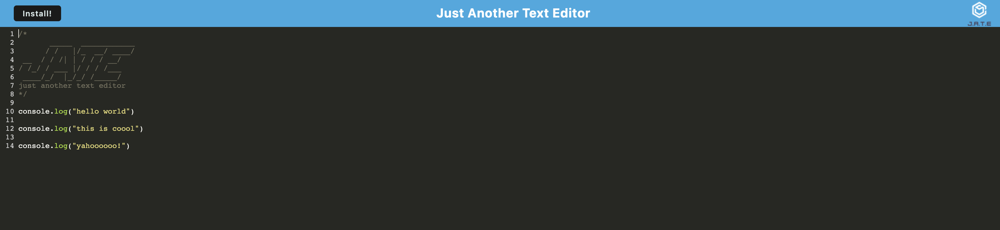

# Text-Editor-PWA

## Description
This is a quick text editor app that uses webpacks and service workers, you can use this online or offline. You can also download it as an application. 
## Installation
Please download the repo from the repository. Otherwise, you can go to the deployed page (link below) and click 'Install' in the top left corner.

## Usage
J.A.T.E is "Just Another Text Editor", just type along and the application will save the data to the database and locally. When you revisit the page you will be able to see your previous content, and contiually update it with new content

## Credits
N/A
## License
N/A

## Link to Deployed Application
[Link to application](https://charlee-jate.herokuapp.com/)